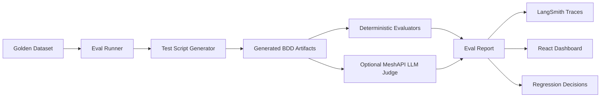

# Evals Project

Evaluation foundation for a Python/LangChain/LangGraph test script generator agent that produces Playwright-BDD style scripts.


The visual above summarizes the intended eval operating system: golden datasets, deterministic checks, tracing, CI gates, online monitoring, and human review around the generated Playwright-BDD scripts.

The first checkpoint implements:

- Versioned golden dataset for app-flow-to-test-script generation.
- Deterministic evaluators for BDD structure, flow coverage, missing data, static script quality, and safety.
- MeshAPI-compatible LLM judge adapter for semantic quality checks.
- LangSmith-ready tracing hooks and optional LangGraph eval workflow.
- CI-friendly pytest runner.
- React dashboard scaffold for viewing eval reports.

## Logical Flow

The project is designed as an eval operating system around the script generator agent. The current scaffold uses `FixtureScriptGenerator` so the eval harness can run before the real LangGraph agent is connected.



Logical steps:

1. Define golden cases in `datasets/golden/test_script_generator.v1.jsonl`.
2. Each case describes the application URL, functional flows, known test data, and expected eval signals.
3. `EvalRunner` loads the dataset and sends each case to the script generator.
4. The script generator returns BDD artifacts: feature text, step definitions, page-object text, missing data, assumptions, and trace metadata.
5. Deterministic evaluators score the artifact for BDD structure, flow coverage, missing-data detection, static script quality, and safety.
6. If `--include-llm-judge` is enabled, MeshAPI scores semantic script quality using an LLM-as-judge rubric.
7. The runner writes `reports/eval-report.json` and `reports/eval-report.md`.
8. LangSmith tracing can capture the eval run and node-level behavior when tracing is enabled.
9. The React dashboard reads the report shape and shows scores, cases, metrics, and failures.
10. Failed or weak cases become new golden dataset examples, improving the next regression run.

Key files:

- Dataset: `datasets/golden/test_script_generator.v1.jsonl`
- Runner: `src/evals_project/runner.py`
- Evaluators: `src/evals_project/evaluators.py`
- MeshAPI judge: `src/evals_project/judges.py`
- LangGraph hook: `src/evals_project/graph.py`
- Reports: `reports/eval-report.json` and `reports/eval-report.md`
- Dashboard: `ui/src/main.jsx`

## MeshAPI Configuration

MeshAPI is OpenAI-compatible. Copy the example file and keep your real keys in a local `.env` file:

```powershell
Copy-Item .env.example .env
```

Then edit `.env`:

```text
MESHAPI_API_KEY=rsk_your_key
MESHAPI_BASE_URL=https://api.meshapi.ai/v1
MESHAPI_MODEL=openai/gpt-4o

LANGSMITH_TRACING=true
LANGSMITH_API_KEY=lsv2_your_key
LANGSMITH_PROJECT=agentic-testgen-evals
```

The project loads `.env` automatically. Exported shell variables still win over `.env` values, which is useful for CI/CD overrides. You can point to another env file with `EVALS_ENV_FILE`.

## Local Commands

Install and run deterministic eval tests:

```powershell
uv run --extra dev pytest
```

Run the eval harness over the golden dataset:

```powershell
uv run --extra dev evals-project run `
  --dataset datasets/golden/test_script_generator.v1.jsonl `
  --report-json reports/eval-report.json `
  --report-md reports/eval-report.md
```

Run with MeshAPI-backed LLM judge enabled:

```powershell
uv run --extra ai --extra dev evals-project run `
  --dataset datasets/golden/test_script_generator.v1.jsonl `
  --include-llm-judge
```

## Current Eval Gates

- BDD structure score must pass.
- Required flows must be represented.
- Required missing-data keys must be surfaced.
- Generated script must include Playwright and BDD integration markers.
- Unsafe/destructive content must be absent.
- Overall score defaults to `0.8`.

## React Dashboard

The UI scaffold lives in `ui/` and reads the same report shape emitted by the CLI.

```powershell
cd ui
npm install
npm run dev
```
